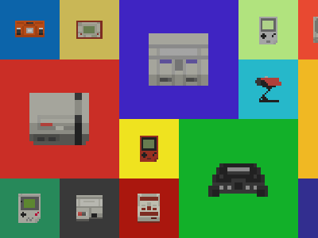
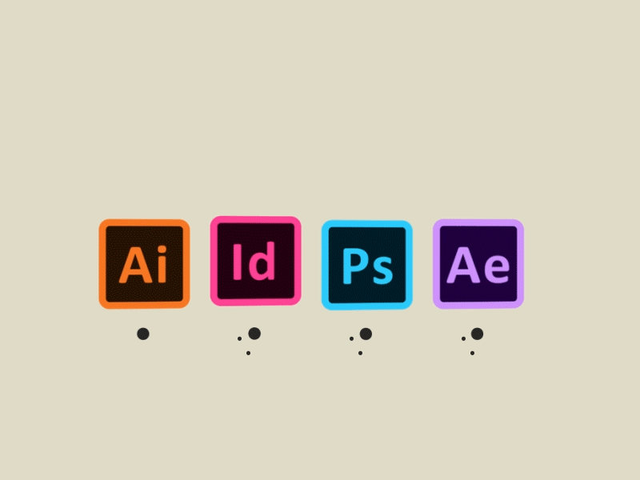
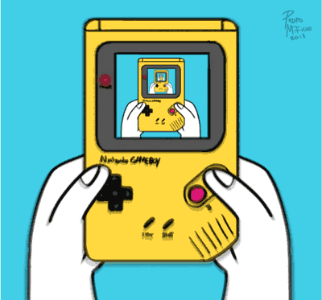
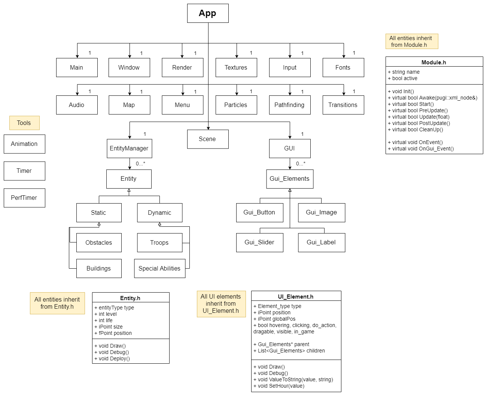
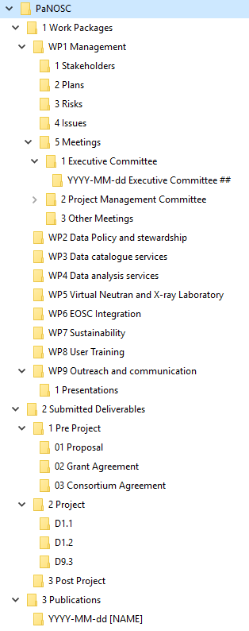
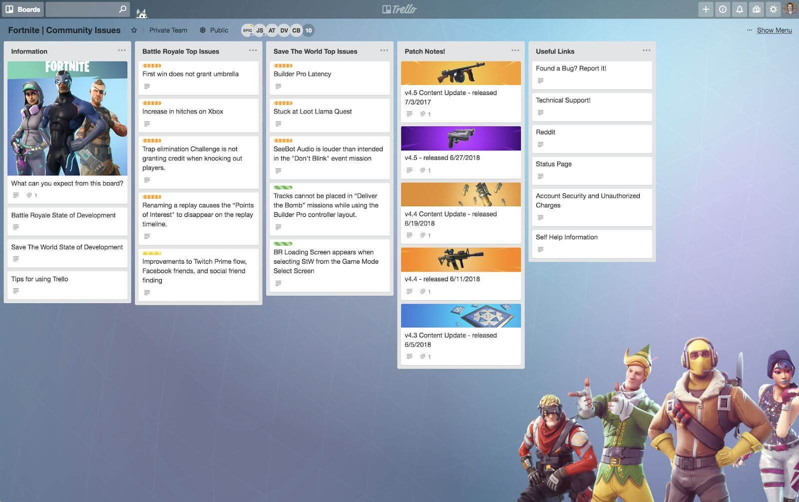

# Technical Design Document

I am [Enric-G. Durán](https://github.com/EnricGDV), student of the UPC [Bachelor’s Degree in Video Game Development at CITM](https://www.citm.upc.edu/ing/estudis/graus-videojocs/). This content corresponds to the second year’s subject Project 2, under the supervision of lecturer [Ramón Santamaría](https://www.linkedin.com/in/raysan/)

## Index

- [The Problem](https://enricgdv.github.io/Research-TDD/#the-problem)

- [Approaches](https://enricgdv.github.io/Research-TDD/#approaches)
  - [In Software](https://enricgdv.github.io/Research-TDD/#in-software)
  - [In Games](https://enricgdv.github.io/Research-TDD/#in-games)
  - [In this Subject](https://enricgdv.github.io/Research-TDD/#in-this-subject)

- [My Solution](https://enricgdv.github.io/Research-TDD/#my-solution)
    - [Introduction](https://enricgdv.github.io/Research-TDD/#1--introduction)
    - [Technical Goals](https://enricgdv.github.io/Research-TDD/#2--target-platform)
    - [Development Hardware](https://enricgdv.github.io/Research-TDD/#3--development-hardware)
    - [Development Software](https://enricgdv.github.io/Research-TDD/#4--development-software)
    - [Game Mechanics](https://enricgdv.github.io/Research-TDD/#5--game-mechanics)
    - [Code Style](https://enricgdv.github.io/Research-TDD/#6--code-style)
    - [UML](https://enricgdv.github.io/Research-TDD/#7--uml)
    - [Data Layout](https://enricgdv.github.io/Research-TDD/#8--data-layout)
    - [Scheduling](https://enricgdv.github.io/Research-TDD/#9--scheduling)
    - [Build Delivery Method](https://enricgdv.github.io/Research-TDD/#10--build-delivery-method)
  

- [Exercise](https://enricgdv.github.io/Research-TDD/#exercise)

- [Bibliography](https://enricgdv.github.io/Research-TDD/#bibliography)

## The Problem

The need for a Tech Design Document is one of structure and organization so that the members of the team know the circumstances the project is surrounded by. It also goes into detail explaining in which way the mechanics and the feel the GDD conceptualizes are going to be implemented in code.  
A TDD basically works like a blueprint for the programmers or engineers in the team to implement their code properly, just like an architect would do with a building so that the construction workers follow the conventions.


Apart from coders, the rest of the team also benefits from knowing the TDD as it specifies every piece of hardware or software to use in the process and lets them know the limits of what they can make or design.
Without a TDD, a project is almost undoubtedly going to suffer from lacking information about its limitations, scope and procedures to stick to when it comes to coding.

## Approaches
Once we understand the importance of making a TDD for our project, we should search for references from other teams that have similar needs to ours in order to find a proper structure and really understand what this document is about.

### In Software
For software creation in general, [TDDs](https://medium.com/machine-words/writing-technical-design-docs-revisited-850d36570ec) are very related to research and the functionality of the code itself: the questions and the answers the program wants to provide. However, in essence, the template for any TDD follows the same logical order that goes from what we want to do to what platform do we do it for, how we do it, where we do it and how we deliver it.


(for more examples go to [Bibliography](https://enricgdv.github.io/Research-TDD/#bibliography))

### In Games
In game creation [TDDs](https://github.com/GameDesign/Zero/wiki/Technical-Design-Document#Game_Overview) is where we can find examples similar to what our document should be like. We can see different structures depending on what the focus is, however, most examples you can find will follow the same important bullet points. One important thing to take into account, though, is that our project's scope is very different from big productions and there are technical differences between genres, platforms, artstyles...


(for more examples go to [Bibliography](https://enricgdv.github.io/Research-TDD/#bibliography))

### In this Subject
Finally, we need to know that we are not the only ones that have done this project and we can look back to see what [TDD](https://github.com/DevCrumbs/Warcraft-II/wiki/7.-Tech-Design-Document) proposals other students came up with in past years for a situation nearer to the scope of our own project. The point of this is NOT copying, but learning from them and improving their proposals.


(for more examples go to [Bibliography](https://enricgdv.github.io/Research-TDD/#bibliography))

## My Solution
After my research through different structures proposed online, I arrived to the following TDD template:

### 1  Introduction
Includes the name of the game, the team members, a brief description (genre, main mechanics, feel...), the code language and the licensing.
It keeps the goal and the basics of the project in the mind of the engineers.

### 2  Technical Goals
Includes the chosen platform for the project and its technical specifications.
But most importantly, it includes the **performance budgets**, which are the resources the game can afford to use and are mesured in many ways: fps, quantity of textures, waiting time.... These are affected by the genre, mechanics, style and platform, but moreover, the resources of the team.
The performance budgets should be made considering  **the target platform** and vice-versa as an incongruence between them could cause the game to be too powerful for a platform or not use the resources the platform offers.

More about [Performance Budgets](https://web.dev/performance-budgets-101/)...



### 3  Development Hardware
Similar to the case of the **Target Platform**, here we should find the minimum requirements for the pieces of hardware we plan on using for the making of the game: Computers( Minimum OS version, speed at which programs should run...), Screens, Art Tools (graphic tablets, more powerful computers for rendering, cameras...), etc.

### 4  Development Software
Specification of the software and pre-existing code that will be used during the project as well as what the software is going to be used for. This englobes any piece of software that the developers of the game haven't made and need to know how to use to implement in the project.



**GitHub Branching:**
GitHub, which is a platform used to share the work environment of the project, allows developers to work in different branches. This is called branching and while useful, this establishes a following of rules and conventions that must be followed every commit. It is important that the branches are explained in the TDD **so that this advantage doesn't become a setback for the project.**

### 5  Game Mechanics
Here each of the parts of the game that need to be implemented in the code are explained.

**Technical Requirements:** A list of every important feature that the team needs to develop and implement into the game and what the plan to do it is (i.e. Entity System, Split Screen, Random Map Generation...)

**Game Architecture:** A diagram or a written explanation of the game loop and how data is managed (saved and loaded) trhoughout the game.



**Graphics and Audio:** Specifications for graphics (screen resolution, tile dimensions, ...) and audio (format, channels, ...) accompanied by a short explanation of their implementation.

**Artificial Intelligence:** Explanation of the AI's behaviour and role in the gameplay as well as which entities are controlled by it.

**Logic:** Diagram or written explanation of the Entity System and Game Object hierarchy.

**Physics and Collisions:** Analysis of the functionality of collisions and physics of the game (Are they realistic? To which objects are they applied?)

**Network:** Only needed in the case that the game has online features.

### 6  Code Style
Every project should follow a **homogeneous set of rules** for all the code that is implemented by the different programmers so that the project has better intelligibility for any interested people who might see it and also for the participants. Having a homogeneous code style is a very easy way to avoid time of debugging and fixing errors. The strictness of the code style guidelines is different in every team, but some examples of conventions would be:

- **Naming Rules:** These explain rules like the code language, how variables act and are created, signs like parenthesis or claudators and the perspective on comments.
For example:

```
Every variable should start with a lower case letter
uint life 100
```

- **Variables:** How to manage, declare and initialize variables and whether to declare them inside ```public```, ```protected``` or ```private``` part when using classes or structs. For example:

```
 Every time a pointer is created must be initialized as null:
 int* test = nullptr;
```

- **Loops:** Names the loop expressions preferred inside the code (```while```, ```do-while```, ```for```,...) and when to use the ```break``` and ```continue``` keywords.

- **Conditionals:** Describes conditionals use, the rules of separation of lines using ```if```, where to use scopes ```{}``` or if conditionals with operators are preferred. For example:

```
  We prefer a conditional like if(something == true) {}
  rather than one like if(something) {}
```

- **Classes & Structs:** Rules about how to choose between classes or structs and how to write elements inside them.

- **XML:** States how to write variables in XML files for the game and how to use their nodes and attributes. For example:

```
  If a node has more than one attribute we'll declare them in different lines:
 <house> 
  <colour="red"/>
  <walls=4/>
 </house>
```

This list of elements has been made taking [DLorenzoLaguno](https://dlorenzolaguno17.github.io/)’s TDD as a reference.


### 7  UML
Main UML of the **Code Organization Overview**. An UML diagram of all the code in the project that shows every class, the inheritance between them and the variables and functions allocated inside. This diagram is supposed to change throughout the time of development, increasing its size and complexity.



Image of [DevCrumb](https://github.com/DevCrumbs/Warcraft-II/)’s general UML for their game Warcraft II: The Stolen Artifacts.

### 8  Data Layout
Diagram or explanation of how the folders of the project are distributed and a brief explanation stating the logic behind it.



### 9  Scheduling
Here we can find a calendar or graph (trello style) with every feature to include in the game, the person in charge of it and its delivery date. It should as well include all the vertical slices, builds and sprints allocated during the project. This schedule is a form of orientation and is most definitely going to change.



In addition, there will also be a list of every version planned from the start of the project as a guideline for the order of the features implemented and such.

### 10  Build Delivery Method
This section allocates an explanation of how every build will be created in the project.

## Exercise
In the case that there is time left, the students will be asked to form their project II groups, choose a game and decide what the main points of the TDD could have been like for its development.

## Bibliography

[Last year's research](https://dlorenzolaguno17.github.io/TDD/)

[TDD Purpose](https://www.wisdomjobs.com/e-university/game-developing-tutorial-261/purpose-of-the-technical-design-document-6737.html)

[Software TDD 1](https://medium.com/machine-words/writing-technical-design-docs-71f446e42f2e)

[Software TDD 2](https://medium.com/machine-words/writing-technical-design-docs-revisited-850d36570ec)

[Software TDD 3](https://www.range.co/blog/better-tech-specs)

[Software TDD 4](https://www.toptal.com/freelance/why-design-documents-matter)

[Game TDD](https://www.studytonight.com/3d-game-engineering-with-unity/tdd-and-gdd)

[TDD Example 1](https://computergamesmmu.files.wordpress.com/2012/10/technical-design-document-final.pdf)

[TDD Example 2](https://github.com/GameDesign/Zero/wiki/Technical-Design-Document#Game_Overview)

[TDD Example 3](https://github.com/DevCrumbs/Warcraft-II/wiki/7.-Tech-Design-Document)

[TDD Example 4](https://flylib.com/books/en/3.36.1.158/1/)

[Performance Budgets](https://web.dev/performance-budgets-101/)

[Branching in GitHub](https://help.github.com/en/github/collaborating-with-issues-and-pull-requests/about-branches)
