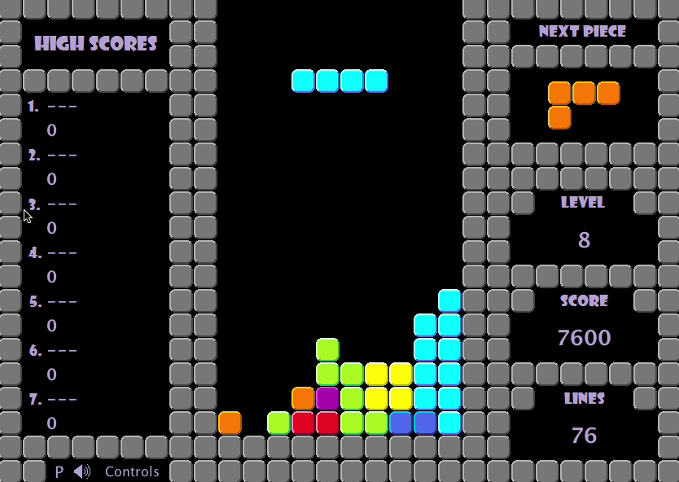
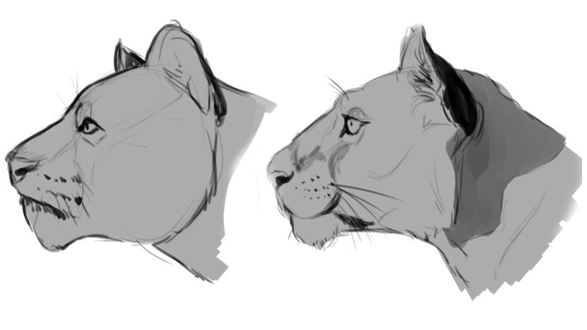

# Technical Design Document

I am [Enric-G. Durán](https://github.com/EnricGDV), student of the UPC [Bachelor’s Degree in Video Game Development at CITM](https://www.citm.upc.edu/ing/estudis/graus-videojocs/). This content corresponds to the second year’s subject Project 2, under the supervision of lecturer [Ramón Santamaría](https://www.linkedin.com/in/raysan/)

## Index

- [The Problem](https://enricgdv.github.io/Research-TDD/#the-problem)

- [Approaches](https://enricgdv.github.io/Research-TDD/#approaches)
  - [In Software](https://enricgdv.github.io/Research-TDD/#in-software)
  - [In Games](https://enricgdv.github.io/Research-TDD/#in-games)
  - [In this Subject](https://enricgdv.github.io/Research-TDD/#in-this-subject)

- [My Solution](https://enricgdv.github.io/Research-TDD/#my-solution)
     1. [Introduction](https://enricgdv.github.io/Research-TDD/#1--introduction)
     2. [Target Platform](https://enricgdv.github.io/Research-TDD/#2--target-platform)
     3. [Development Hardware](https://enricgdv.github.io/Research-TDD/#3--development-hardware)
     4. [External Tools](https://enricgdv.github.io/Research-TDD/#4--external-tools)
     5. [Game Mechanics](https://enricgdv.github.io/Research-TDD/#5--game-mechanics)
     6. [Code Style](https://enricgdv.github.io/Research-TDD/#6--code-style)
     7. [Diagrams](https://enricgdv.github.io/Research-TDD/#7--diagrams)
     8. [Data Layout](https://enricgdv.github.io/Research-TDD/#8--data-layout)
     9. [Scheduling](https://enricgdv.github.io/Research-TDD/#9--scheduling)
     10. [Build Delivery Method](https://enricgdv.github.io/Research-TDD/#10--build-delivery-method)
  

- [Exercise](https://enricgdv.github.io/Research-TDD/#exercise)

- [Bibliography](https://enricgdv.github.io/Research-TDD/#bibliography)

## The Problem

The need for a Tech Design Document is one of structure and organization so that the members of the team know the circumstances the project is surrounded by. It also goes into detail explaining in which way the mechanics and the feel the GDD conceptualizes are going to be implemented in code.  
A TDD basically works like a blueprint for the programmers or engineers in the team to implement their code properly, just like an architect would do with a building so that the construction workers follow the conventions.


Apart from coders, the rest of the team also benefits from knowing the TDD as it specifies every piece of hardware or software to use in the process and lets them know the limits of what they can make or design.
Without a TDD, a project is almost undoubtedly going to suffer from lacking information about its limitations, scope and procedures to stick to when it comes to coding.

## Approaches
Once we understand the importance of making a TDD for our project, we should search for references from other teams that have similar needs to ours in order to find a proper structure and really understand what this document is about.

### In Software
For software creation in general, [TDDs](https://medium.com/machine-words/writing-technical-design-docs-revisited-850d36570ec) are very related to research and the functionality of the code itself: the questions and the answers the program wants to provide. However, in essence, the template for any TDD follows the same logical order that goes from what we want to do to what platform do we do it for, how we do it, where we do it and how we deliver it.


(more examples seen in the bibliography)

### In Games
In game creation [TDDs](https://github.com/GameDesign/Zero/wiki/Technical-Design-Document#Game_Overview) is where we can find examples similar to what our document should be like. We can see different structures depending on what the focus is, however, most examples you can find will follow the same important bullet points. One important thing to take into account, though, is that our project's scope is very different from big productions and there are technical differences between genres, platforms, artstyles...


(more examples seen in the bibliography)

### In this Subject
Finally, we need to know that we are not the only ones that have done this project and we can look back to see what [TDD](https://github.com/DevCrumbs/Warcraft-II/wiki/7.-Tech-Design-Document) proposals other students came up with in past years for a situation nearer to the scope of our own project. The point of this is NOT copying, but learning from them and improving their proposals.



## My Solution


### 1  Introduction

### 2  Target Platform

### 3  Development Hardware

### 4  External Tools

### 5  Game Mechanics

### 6  Code Style

### 7  Diagrams

### 8  Data Layout

### 9  Scheduling

### 10  Build Delivery Method

## Exercise

## Bibliography

[Last year's research](https://dlorenzolaguno17.github.io/TDD/)

[TDD Purpose](https://www.wisdomjobs.com/e-university/game-developing-tutorial-261/purpose-of-the-technical-design-document-6737.html)

[Software TDD 1](https://medium.com/machine-words/writing-technical-design-docs-71f446e42f2e)

[Software TDD 2](https://medium.com/machine-words/writing-technical-design-docs-revisited-850d36570ec)

[Software TDD 3](https://www.range.co/blog/better-tech-specs)

[Software TDD 4](https://www.toptal.com/freelance/why-design-documents-matter)

[Game TDD](https://www.studytonight.com/3d-game-engineering-with-unity/tdd-and-gdd)

[TDD Example 1](https://computergamesmmu.files.wordpress.com/2012/10/technical-design-document-final.pdf)

[TDD Example 2](https://github.com/GameDesign/Zero/wiki/Technical-Design-Document#Game_Overview)

[TDD Example 3](https://github.com/DevCrumbs/Warcraft-II/wiki/7.-Tech-Design-Document)

[TDD Example 4](https://flylib.com/books/en/3.36.1.158/1/)

[Branching in GitHub](https://help.github.com/en/github/collaborating-with-issues-and-pull-requests/about-branches)


### Markdown

Markdown is a lightweight and easy-to-use syntax for styling your writing. It includes conventions for

```markdown
Syntax highlighted code block

# Header 1
## Header 2
### Header 3

- Bulleted
- List

1. Numbered
2. List

**Bold** and _Italic_ and `Code` text

[Link](url) and 
```

For more details see [GitHub Flavored Markdown](https://guides.github.com/features/mastering-markdown/).

### Jekyll Themes

Your Pages site will use the layout and styles from the Jekyll theme you have selected in your [repository settings](https://github.com/EnricGDV/Research-TDD/settings). The name of this theme is saved in the Jekyll `_config.yml` configuration file.

### Support or Contact

Having trouble with Pages? Check out our [documentation](https://help.github.com/categories/github-pages-basics/) or [contact support](https://github.com/contact) and we’ll help you sort it out.
